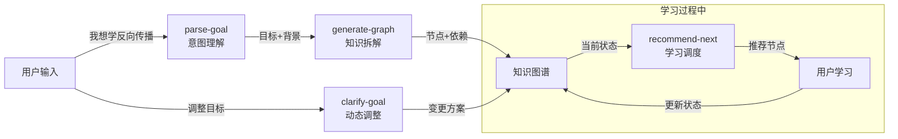
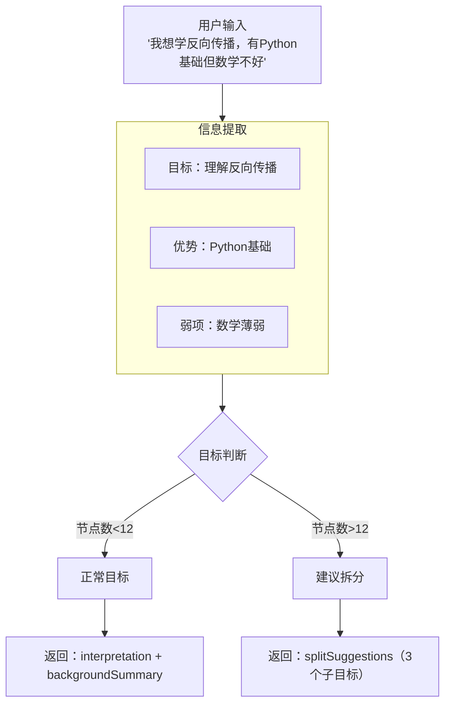
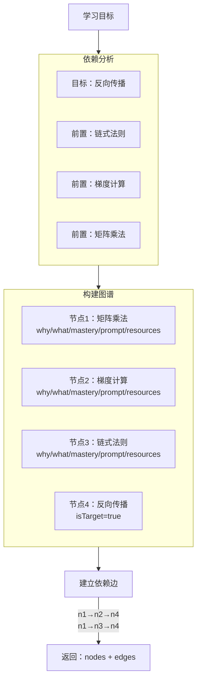
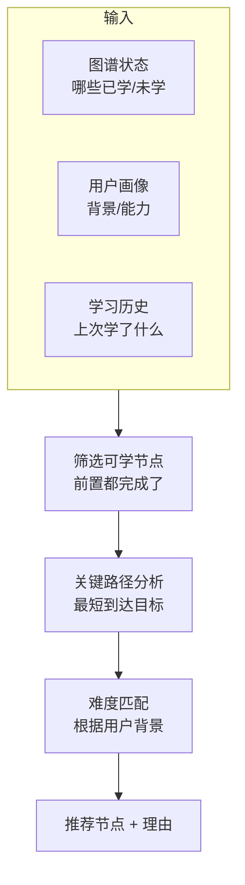
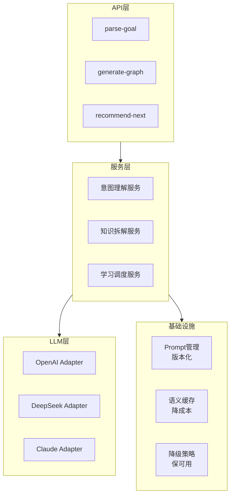
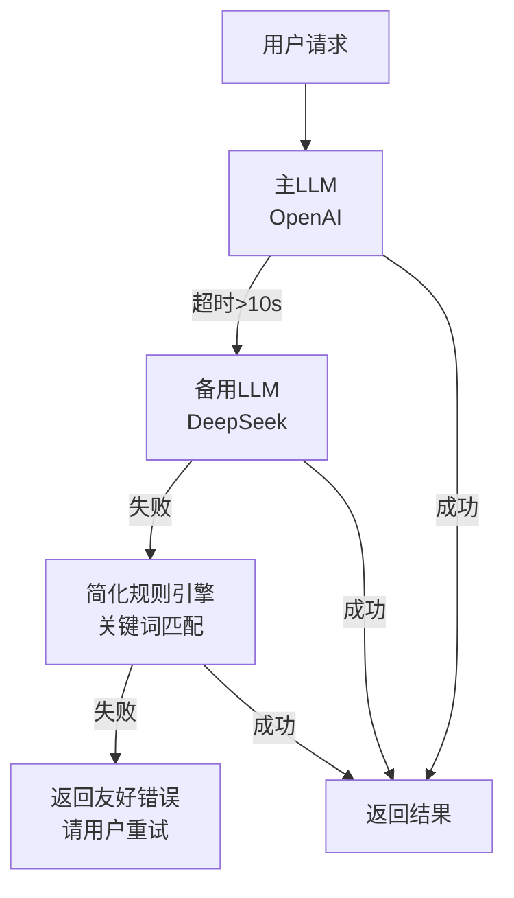
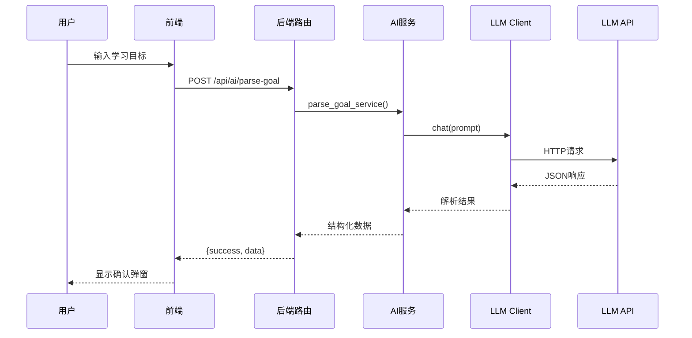

# AI服务Mermaid图解

> **一句话总结**：AI服务把用户模糊的学习意图转化为结构化知识图谱，核心流程是意图理解→知识拆解→图谱生成。

---

## 图1：宏观数据流（L1）

### 说人话
用户说一句话 → AI理解意图 → 拆解成知识图谱 → 学习过程中AI推荐下一步 → 目标变了AI帮忙调整。

---

## 图2：意图理解流程（L2）

### 说人话
从用户输入里提取：想学什么、有什么基础、哪里薄弱。如果目标太大（超过12个节点），建议拆成子目标。

---

## 图3：知识拆解流程（L2）

### 说人话
分析学这个目标需要先学什么，每个知识点生成：为什么学、学什么、怎么算学会、问AI的Prompt、推荐资源。

---

## 图4：学习调度流程（L2）

### 说人话
推荐下一步时考虑：哪些节点可以学了（前置都完成了）、哪条路径最快到达目标、难度适不适合用户当前水平。

---

## 图5：工程化架构（L2）

### 说人话
API调用服务，服务调用LLM，基础设施层管Prompt版本、缓存、降级。

---

## 图6：降级策略（L3）

### 说人话
主LLM超时→切备用LLM→备用也挂了→用简单规则兜底→全挂了→告诉用户稍后再试。

---

## 图7：调用链路时序（L3）

### 说人话
用户输入→前端调后端→后端调AI服务→AI服务调LLM Client→Client调OpenAI/DeepSeek→层层返回→前端显示结果。

---

## 关键设计对照表

| 设计点 | 目的 | 实现方式 |
|--------|------|---------|
| **多LLM支持** | 可切换、可降级 | Adapter模式 |
| **Prompt版本化** | 快速迭代A/B测试 | 文件管理+Jinja2 |
| **语义缓存** | 降成本 | 向量相似度匹配 |
| **JSON Schema** | 输出可预期 | 强制校验LLM输出 |
| **3级降级** | 保可用 | 主LLM→备用→规则→错误 |

---

