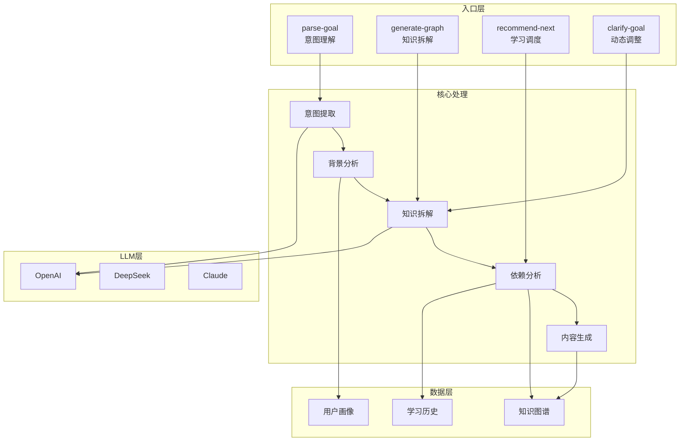
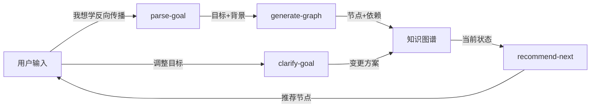

# 后端接口规格 - AI服务

> 通用规范（错误码、响应格式等）见 [后端-通用规范.md](./后端-通用规范.md)\
> 最后同步：2026-03-17

一致性标记：✅（parse-goal / generate-graph / clarify-goal 已接入真实 Kimi 2.5 大模型；Prompt 配置已从 .txt 迁移至 JSON；user_background 全链路打通）

***

## 实现状态

- [x] `POST /api/ai/parse-goal` - 解析学习目标 → **✅ 真实 LLM**
- [x] `POST /api/ai/generate-graph` - 生成知识图谱 → **✅ 真实 LLM**
- [ ] `POST /api/ai/recommend-next` - 推荐下一节点（前端已用规则引擎实现，后端 Phase 5 规划）→ ❌
- [x] `POST /api/ai/clarify-goal` - 澄清目标 → **✅ 真实 LLM**

***

## 接口清单

| 方法   | 路由                       | 说明     | 契约需认证 | 当前实现需认证 | 状态 | 代码                                        |
| ---- | ------------------------ | ------ | ----- | ------- | -- | ----------------------------------------- |
| POST | `/api/ai/parse-goal`     | 解析学习目标 | ✅     | ✅       | ✅  | [ai.py](../backend/routers/ai.py) / [ai_service.py](../backend/services/ai_service.py) |
| POST | `/api/ai/generate-graph` | 生成知识图谱 | ✅     | ✅       | ✅  | [ai.py](../backend/routers/ai.py) / [ai_service.py](../backend/services/ai_service.py) |
| POST | `/api/ai/recommend-next` | 推荐下一节点 | ✅     | ❌       | ❌  | 规划中（前端已有规则引擎替代）|
| POST | `/api/ai/clarify-goal`   | 澄清目标   | ✅     | ✅       | ✅  | [ai.py](../backend/routers/ai.py) / [ai_service.py](../backend/services/ai_service.py) |

***

## 整体架构设计

### 1. 设计目标

AI服务的核心目标是：**把用户模糊的学习意图转化为结构化的、可执行的学习路径**。

具体包括：

- **意图理解**：理解用户想学什么、已有什么基础
- **知识拆解**：把大目标拆解成有依赖关系的知识点
- **智能推荐**：根据学习状态推荐下一步
- **动态调整**：根据用户反馈调整学习方向

### 2. 体系架构图



### 3. 数据流架构



### 4. 分层架构

```
┌─────────────────────────────────────────────────────────────┐
│                        API Layer                            │
│  POST /api/ai/parse-goal    POST /api/ai/generate-graph    │
│  POST /api/ai/recommend-next  POST /api/ai/clarify-goal    │
└──────────────────────┬──────────────────────────────────────┘
                       │
┌──────────────────────▼──────────────────────────────────────┐
│                   Service Layer                             │
│  ┌──────────────┐  ┌──────────────┐  ┌──────────────┐      │
│  │ParseGoal     │  │GenerateGraph │  │RecommendNext │      │
│  │Service       │  │Service       │  │Service       │      │
│  └──────┬───────┘  └──────┬───────┘  └──────┬───────┘      │
└─────────┼─────────────────┼─────────────────┼──────────────┘
          │                 │                 │
          └─────────────────┼─────────────────┘
                            │
┌───────────────────────────▼────────────────────────────────┐
│                  LLM Client Layer                           │
│  ┌─────────────────────────────────────────────────────┐   │
│  │              Unified LLM Client                      │   │
│  │  ┌──────────┐  ┌──────────┐  ┌──────────┐          │   │
│  │  │ OpenAI   │  │ DeepSeek │  │ Claude   │  ...      │   │
│  │  │ Adapter  │  │ Adapter  │  │ Adapter  │          │   │
│  │  └──────────┘  └──────────┘  └──────────┘          │   │
│  └─────────────────────────────────────────────────────┘   │
└───────────────────────────┬────────────────────────────────┘
                            │
┌───────────────────────────▼────────────────────────────────┐
│              Infrastructure Layer                           │
│  ┌──────────────┐  ┌──────────────┐  ┌──────────────┐     │
│  │Prompt Manager│  │Response Parser│  │Error Handler│     │
│  │(版本管理)     │  │(结构化输出)   │  │(重试/降级)   │     │
│  └──────────────┘  └──────────────┘  └──────────────┘     │
│  ┌──────────────┐  ┌──────────────┐  ┌──────────────┐     │
│  │Cache Layer   │  │Rate Limiter  │  │Cost Tracker  │     │
│  │(语义缓存)     │  │(限流保护)     │  │(成本监控)     │     │
│  └──────────────┘  └──────────────┘  └──────────────┘     │
└────────────────────────────────────────────────────────────┘
```

### 3. 设计原则

| 原则            | 说明                             |
| ------------- | ------------------------------ |
| **多LLM支持**    | 通过Adapter模式支持多个LLM提供商，可切换、可降级  |
| **Prompt版本化** | Prompt模板文件化管理，支持A/B测试和快速迭代     |
| **输出可预期**     | 使用JSON Schema强制校验LLM输出，保证前端可用性 |
| **容错降级**      | 3级降级策略（切换LLM→简化规则→友好错误）        |
| **成本控制**      | 语义缓存+Token计费，降低重复调用成本          |

***

## 功能概述（说人话）

### 首页AI流程

```
用户输入"我想学反向传播，我有Python基础但数学不好"
    ↓
[调用 parse-goal] AI分析这句话
    ↓
AI做的事情：
  1. 理解目标 → "理解反向传播的数学原理"
  2. 提取背景 → Python基础(优势)、数学薄弱(弱项)
  3. 估算规模 → 预计7个节点
  4. 判断是否需要拆分 → 否
    ↓
显示确认弹窗让用户确认
    ↓
用户点"确认生成"
    ↓
[调用 generate-graph] AI生成完整图谱（15-30秒）
    ↓
AI做的事情：
  1. 拆解需要哪些前置知识
  2. 分析知识点之间的依赖关系
  3. 为每个节点生成：为什么学、学什么、掌握标准、学习Prompt、推荐资源
  4. 根据用户画像自动标记已掌握的知识点为"跳过"
    ↓
[调用 create-plan] 保存为计划
    ↓
跳转到图谱页
```

### 图谱页AI流程

```
用户打开图谱页
    ↓
[调用 recommend-next] AI推荐下一步
    ↓
AI考虑的因素：
  - 哪些节点的前置都完成了？（可学）
  - 哪条路径最短到达目标？
  - 用户背景（数学薄弱就推荐基础节点）
  - 学习历史（上次学了什么）
    ↓
显示在画布底部："推荐下一步：链式法则 - 这是通往反向传播的关键路径"
```

### 调整目标AI流程

```
用户点"修改目标"，输入"我更想聚焦代码实现"
    ↓
[调用 clarify-goal] AI分析调整方案
    ↓
AI做的事情：
  1. 理解新目标 → "反向传播的代码实现"
  2. 对比当前图谱 → 保留已学的、移除不相关的、新增需要的
  3. 判断调整幅度 → 保留3个、新增2个、移除2个（正常调整）
    ↓
显示变更预览：
  ┌─────────────┐
  │ 保留 3 个   │
  │ 新增 2 个   │
  │ 移除 2 个   │
  └─────────────┘
    ↓
用户确认后，调用 apply-changes 执行变更
```

***

## 接口详情

### 1. 解析学习目标

**做什么**：

1. 把用户的自由输入解析成结构化的学习目标
2. 从用户输入中提取新的背景信息
3. 从用户画像中筛选与目标相关的能力
4. 判断目标是否太大，太大就给出拆分建议

```
POST /api/ai/parse-goal
```

**请求**：

```json
{
  "input": "我想理解深度学习中的反向传播，我有Python基础但数学不好"
}
```

**成功（正常目标）**：

```json
{
  "success": true,
  "data": {
    "interpretation": "理解反向传播的数学原理",
    "backgroundSummary": [
      { "text": "Python入门", "source": "profile", "isStrength": true },
      { "text": "数学薄弱", "source": "input", "isStrength": false }
    ],
    "suggestedNodeCount": 7,
    "shouldSplit": false,
    "splitSuggestions": null
  }
}
```

**成功（目标太大，需要拆分）**：

```json
{
  "success": true,
  "data": {
    "interpretation": "深度学习",
    "backgroundSummary": [],
    "suggestedNodeCount": 25,
    "shouldSplit": true,
    "splitSuggestions": [
      {
        "title": "理解神经网络基础",
        "description": "从感知机到多层神经网络",
        "estimatedNodes": 6
      },
      {
        "title": "理解反向传播算法",
        "description": "深度学习训练的核心",
        "estimatedNodes": 7
      }
    ]
  }
}
```

**AI要做的事情**：

1. **意图理解**：从自由文本中提取核心学习目标
2. **背景提取**：识别用户的已有能力和薄弱环节
3. **规模估算**：预估需要多少个知识点节点
4. **拆分判断**：如果节点数>12或目标太宽泛，建议拆分

**关于 backgroundSummary**：

- `source: "profile"`：从用户画像匹配到的能力
- `source: "input"`：从本次输入中新发现的背景
- `isStrength`：true表示优势，false表示弱项

**副作用**：从输入中新发现的背景信息（`source: "input"`）自动写入 `user_profiles.abilities`。

***

### 2. 生成知识图谱

**做什么**：根据学习目标，AI生成完整的知识依赖图谱。这是最核心的AI功能。

**注意**：这个接口会比较慢（15-30秒），前端需要显示加载动画。

```
POST /api/ai/generate-graph
```

**请求**：

```json
{
  "input": "我想理解深度学习中的反向传播，我有Python基础但数学不好",
  "interpretation": "理解反向传播的数学原理"
}
```

**成功**：

```json
{
  "success": true,
  "data": {
    "interpretation": "理解反向传播的数学原理",
    "nodes": [
      {
        "id": "n1",
        "name": "矩阵乘法",
        "status": "unlearned",
        "x": -150,
        "y": 100,
        "why": "神经网络的前向传播本质就是 y = Wx + b，理解矩阵乘法才能理解数据如何在网络中流动。",
        "what": ["矩阵乘法的定义", "矩阵维度匹配规则", "Wx + b 的计算过程"],
        "mastery": ["手算 2x3 和 3x2 矩阵相乘", "判断两个矩阵能否相乘"],
        "prompt": "请帮我讲解矩阵乘法，重点是矩阵乘法在神经网络中的应用...",
        "resources": [
          {
            "name": "3Blue1Brown 线性代数",
            "url": "https://...",
            "reason": "可视化讲解"
          }
        ],
        "isTarget": false,
        "domain": "数学基础"
      }
    ],
    "edges": [
      { "from_node": "n1", "to_node": "n3" }
    ],
    "targetNodeId": "n5"
  }
}
```

**AI要做的事情**：

1. **知识拆解**：分析学习目标需要哪些前置知识
2. **依赖分析**：建立知识点之间的前置关系（谁依赖谁）
3. **内容生成**：为每个节点生成完整的学习内容
4. **自动标记**：根据用户画像的`masteredKnowledge`自动标记已掌握节点为`skipped`
5. **布局计算**：计算节点的初始坐标（目标节点在中心，前置知识向外辐射）

**节点字段说明**：

| 字段          | 说明                 |
| ----------- | ------------------ |
| `why`       | 为什么要学这个（和最终目标的关系）  |
| `what`      | 具体要学什么内容（数组）       |
| `mastery`   | 掌握标准（可检验的学习成果）     |
| `prompt`    | 去问AI导师时可以用的提示词     |
| `resources` | 推荐学习资源（名称、链接、推荐理由） |
| `domain`    | 知识领域（用于统计页面的领域分布）  |

***

### 3. 推荐下一学习节点（学习调度Agent）

**做什么**：AI分析当前状态，推荐用户下一步应该学什么。

```
POST /api/ai/recommend-next
```

**请求**：

```json
{
  "planId": "p_abc123"
}
```

后端自己会去查：图谱数据、用户画像、学习历史。

**成功（有推荐）**：

```json
{
  "success": true,
  "data": {
    "recommendedNodeId": "n2",
    "nodeName": "链式法则",
    "reason": "链式法则是通往反向传播的关键路径，且你已完成前置的矩阵乘法"
  }
}
```

**成功（全部学完）**：

```json
{
  "success": true,
  "data": {
    "recommendedNodeId": null,
    "reason": "恭喜！你已完成所有知识点的学习",
    "isComplete": true
  }
}
```

**AI的输入（后端组装）**：

```json
{
  "graph": {
    "nodes": [...],
    "edges": [...],
    "target_node_id": "n5"
  },
  "user_profile": {
    "occupation": "大三计算机学生",
    "programming_level": "入门",
    "math_level": "入门",
    "abilities": ["Python 会基础语法", "线性代数 只记得矩阵乘法"]
  },
  "learning_history": {
    "last_node": "矩阵乘法",
    "last_session": "2024-12-28 15:30",
    "learned_nodes": ["n1", "n3"],
    "skipped_nodes": ["n2"]
  },
  "learning_goal": "理解反向传播的数学原理"
}
```

**推荐逻辑**：

1. 筛选"可学"节点：前置依赖都已完成（learned或skipped）
2. 从可学节点中，选择最接近目标的（关键路径）
3. 考虑用户背景，选择难度合适的
4. 生成人话的推荐理由

***

### 4. 澄清/调整目标

**做什么**：用户想调整学习方向时，AI分析怎么改图谱。

**场景**：用户在图谱页点"修改目标"，输入"我更想聚焦代码实现，数学推导可以简化"

```
POST /api/ai/clarify-goal
```

**请求**：

```json
{
  "planId": "p_abc123",
  "clarification": "我更想聚焦代码实现，数学推导可以简化一些"
}
```

**成功（正常调整）**：

```json
{
  "success": true,
  "data": {
    "newGoal": "反向传播的代码实现",
    "changes": {
      "keep": [
        { "nodeId": "n1", "name": "矩阵乘法", "currentStatus": "learned" }
      ],
      "add": [
        { "tempId": "new_1", "name": "Python实现基础", "why": "..." }
      ],
      "remove": [
        { "nodeId": "n2", "name": "泰勒展开" }
      ]
    },
    "shouldCreateNew": false,
    "warning": null
  }
}
```

**成功（调整幅度太大，建议新建）**：

```json
{
  "success": true,
  "data": {
    "newGoal": "机器学习基础",
    "changes": { ... },
    "shouldCreateNew": true,
    "warning": "调整幅度较大（保留1个，新增6个，移除5个），建议新建计划"
  }
}
```

**成功（用户输入不清晰）**：

```json
{
  "success": true,
  "data": {
    "needMoreInfo": true,
    "questions": ["想增加哪方面内容？", "想减少哪方面内容？"]
  }
}
```

**AI要做的事情**：

1. **理解新目标**：从用户的澄清描述中提取新的学习目标
2. **对比分析**：对比当前图谱和新目标，找出需要保留/新增/移除的节点
3. **幅度判断**：如果变动太大（如保留<30%），建议新建计划
4. **清晰度判断**：如果用户描述模糊，要求补充信息

***

## 工程化设计

### 1. 目录结构（当前实现）

```
backend/
├── services/
│   ├── ai_service.py              # AIService：parse_goal / generate_graph
│   └── llm/
│       ├── __init__.py            # 统一导出
│       ├── client.py              # UnifiedLLMClient（重试 + 降级）
│       ├── providers/
│       │   ├── __init__.py
│       │   ├── base.py            # BaseLLMProvider 抽象基类
│       │   └── openai_compatible.py  # Kimi 2.5 / OpenAI 兼容适配器
│       └── configs/               # JSON Prompt 配置（替代已删除的 prompts/*.txt）
│           ├── __init__.py        # load_ai_config(name, user_input, **kwargs)
│           ├── parse_goal.json    # parse-goal 的 system_prompt / output_format / rules / examples
│           └── generate_graph.json # generate-graph 的同上
├── config.py                      # LLM_* 环境变量配置
└── models.py                      # ParseGoalResponse / GenerateGraphResponse 等 Pydantic 模型
```

> **已删除**：`llm/prompts/parse_goal_v1.txt`、`llm/prompts/generate_graph_v1.txt`、`llm/prompts/__init__.py`（全部被 `configs/` 替代）

### 2. 配置项（当前实现）

```python
# config.py - Settings dataclass（已实现）
LLM_PROVIDER: str = "kimi"                           # 当前默认 Kimi 2.5
LLM_API_KEY: str = ""                                # 必须通过 .env 配置
LLM_BASE_URL: str = "https://api.moonshot.cn/v1"     # Kimi OpenAI-compatible endpoint
LLM_MODEL: str = "kimi-k2-5"
LLM_TIMEOUT: int = 30
LLM_MAX_RETRIES: int = 3
LLM_TEMPERATURE: float = 0.7

# 降级配置（可选）
LLM_FALLBACK_ENABLED: bool = True
LLM_FALLBACK_PROVIDER: str = "openai"
LLM_FALLBACK_API_KEY: str = ""
LLM_FALLBACK_MODEL: str = "gpt-4o-mini"
```

> **注意**：`AI_CACHE_ENABLED` / `AI_RATE_LIMIT_RPM` 在规划文档中出现，但**当前未实现**。

### 3. 降级策略

| 级别 | 触发条件         | 处理方案          |
| -- | ------------ | ------------- |
| L1 | LLM响应慢(>10s) | 切换到备用LLM提供商   |
| L2 | LLM服务不可用     | 返回简化版规则引擎结果   |
| L3 | 完全失败         | 返回友好错误，引导用户重试 |

### 4. 调用流程（当前实现）

```
用户请求 POST /api/ai/parse-goal 或 /api/ai/generate-graph
    ↓
1. 参数校验（Pydantic：长度 5-2000 字符）
    ↓
2. load_ai_config(config_name, user_input, **kwargs)
   → 读取 services/llm/configs/{name}.json
   → 拼装 system_prompt + user_prompt（含 output_format / rules / examples）
   → 提取 model_params（temperature / max_tokens）
    ↓
3. UnifiedLLMClient.chat_json(system_prompt, user_prompt, temperature, max_tokens)
   → OpenAICompatibleProvider.chat(messages, response_format={"type":"json_object"})
   → Kimi 2.5 API 调用（带重试 + 指数退避）
   → 主 Provider 失败 → 尝试 Fallback Provider
    ↓
4. JSON 响应解析（json.loads）
    ↓
5. Pydantic 模型校验（ParseGoalResponse / GenerateGraphResponse）
    ↓
6. 业务校验（targetNode 存在、edges 引用合法）
    ↓
返回 {success: true, data: {...}}
```

> **未实现**：语义缓存、限流、成本追踪（规划文档中提及，当前未实现）

***

## 实现优先级

```
P0（核心功能）：
  ✅ 统一LLM客户端框架（UnifiedLLMClient + OpenAICompatibleProvider）
  ✅ parse-goal Prompt + JSON 解析
  ✅ generate-graph Prompt + JSON 解析
  ✅ JSON Schema 校验（Pydantic）

P1（稳定性）：
  ✅ 重试机制（指数退避，max_retries=3）
  ✅ 降级策略（Fallback Provider）
  ✅ 错误处理（LLMServiceError / ConfigLoadError → 规范 error 响应）

P2（优化）：
  ☐ 语义缓存（未实现）
  ☐ 成本追踪（未实现）
  ✅ Prompt 配置化（JSON configs 替代 Jinja2 .txt 模板）

P3（Phase 5 - 已完成）：
  ✅ clarify-goal 实现（后端端点 + LLM 配置 + 前端 Modal UI）
  ✅ user_background 传参（前端 → 后端 → AI Service → Prompt）
  ☐ recommend-next 后端（前端已有规则引擎，低优先级）
```

***

## 代码位置

- 后端路由：[ai.py](../backend/routers/ai.py)
- AI 服务实现：[ai_service.py](../backend/services/ai_service.py)
- LLM 统一客户端：[services/llm/client.py](../backend/services/llm/client.py)
- OpenAI 兼容适配器：[services/llm/providers/openai_compatible.py](../backend/services/llm/providers/openai_compatible.py)
- Prompt JSON 配置：[services/llm/configs/](../backend/services/llm/configs/)
- 配置加载器：[services/llm/configs/__init__.py](../backend/services/llm/configs/__init__.py)
- 单元 + 集成测试：[tests/test_ai.py](../backend/tests/test_ai.py) / [tests/test_ai_integration.py](../backend/tests/test_ai_integration.py)

***

*文档创建时间：2026-02-04 | 最后同步：2026-03-17*
