# ConceptTree 系统架构图

> **一句话总结**：AI驱动的学习路径生成器，将学习目标转化为可视化知识图谱，支持进度追踪和笔记管理。

---

## 图1：宏观系统架构（L1）

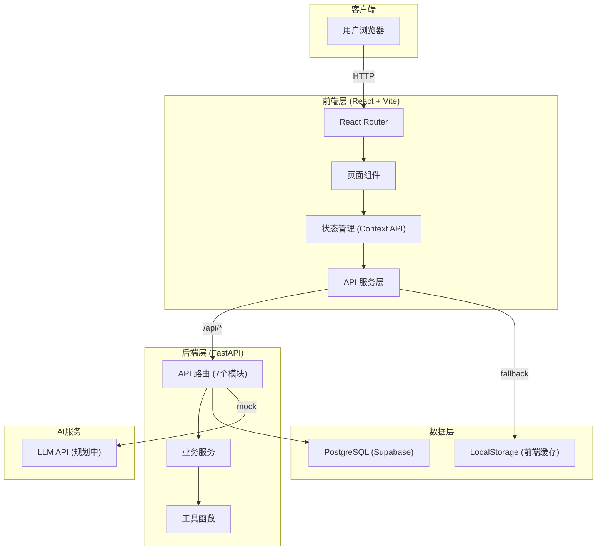

### 说人话
用户打开浏览器 → 前端React应用加载 → 根据URL显示不同页面 → 需要数据时调用后端API → 后端FastAPI处理请求 → 操作PostgreSQL数据库 → 返回数据给前端显示。

---

## 图2：前端架构（L2）

### 2.1 路由结构

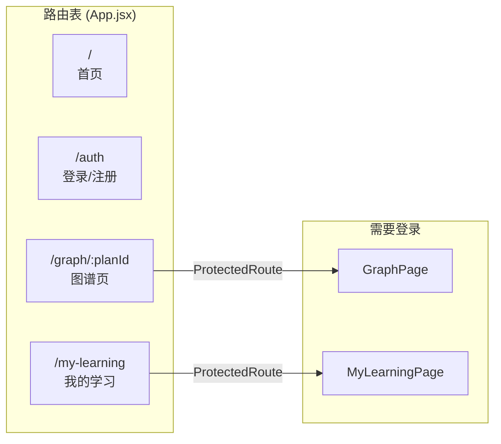

### 说人话
- **首页** (`/`)：输入学习目标，显示进行中的计划
- **认证页** (`/auth`)：登录和注册
- **图谱页** (`/graph/:planId`)：显示知识图谱画布（需登录）
- **我的学习** (`/my-learning`)：归档计划、画像、笔记、统计（需登录）

---

### 2.2 状态管理架构

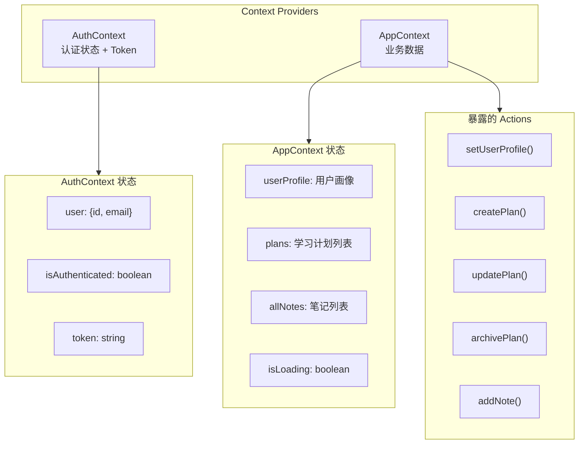

### 说人话
- **AuthContext**：管登录状态，存token，判断用户是否登录
- **AppContext**：管业务数据，包括用户画像、学习计划、笔记等
- 页面通过 `useContext` 获取数据和操作函数

---

### 2.3 API 服务层（Hybrid策略）

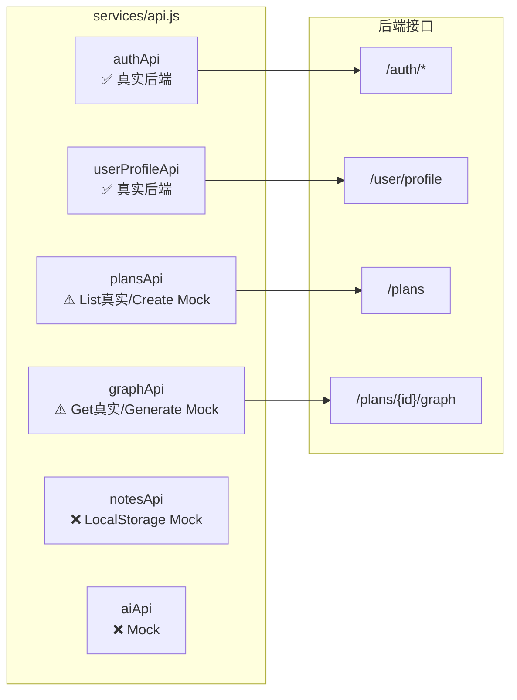

### 说人话
前端API层采用"混合策略"：
- **已完成对接**：认证、用户画像、计划列表、图谱获取
- **部分Mock**：计划创建、图谱生成
- **后端完成前端未对接**：笔记、统计（后端已实现，前端仍为LocalStorage Mock）
- **完全Mock**：AI解析（后端为Mock实现）

### 关键对齐缺口
| 缺口 | 后端字段 | 前端期望 | 影响 |
|------|---------|---------|------|
| edges字段 | `from_node`/`to_node` | `from`/`to` | 图谱连线可能失败 |
| createPlan参数 | 需`originalInput`/`targetNodeId` | 未传 | 创建计划可能失败 |

---

## 图3：后端架构（L2）

### 3.1 API 路由结构

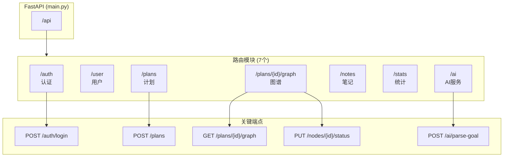

### 说人话
后端有7个路由模块，共26个接口：
- **认证** (`/auth`)：注册、登录、登出
- **用户** (`/user`)：获取/更新用户画像
- **计划** (`/plans`)：CRUD + 归档/恢复
- **图谱** (`/plans/{id}/graph`)：获取图谱、更新节点状态/位置
- **笔记** (`/notes`)：CRUD
- **统计** (`/stats`)：学习统计、领域分布
- **AI** (`/ai`)：目标解析、图谱生成（当前Mock）

---

### 3.2 数据库模型（ER图）

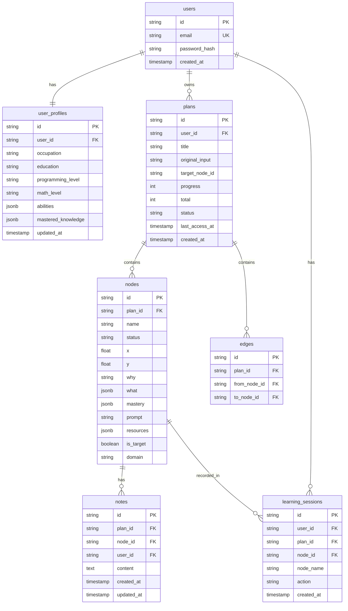

### 说人话
- **users**：用户账号（邮箱、密码）
- **user_profiles**：用户画像（职业、教育背景、能力标签）
- **plans**：学习计划（标题、进度、状态）
- **nodes**：知识节点（名称、状态、坐标、学习内容）
- **edges**：节点间的依赖关系
- **notes**：用户对节点的笔记
- **learning_sessions**：学习记录（用于统计和推荐）

---

## 图4：数据流架构（L2）

### 4.1 用户登录流程

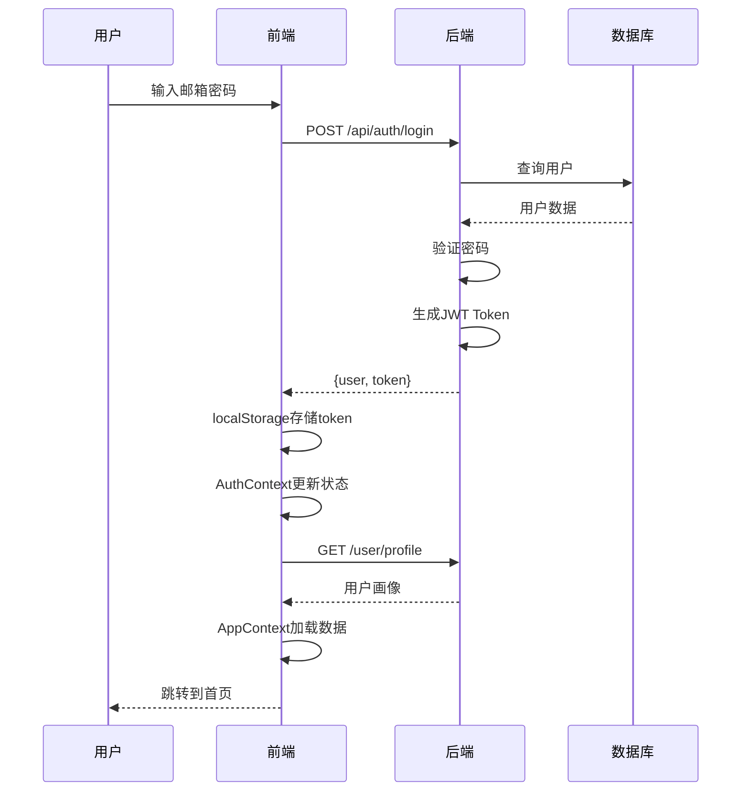

### 4.2 创建学习计划流程

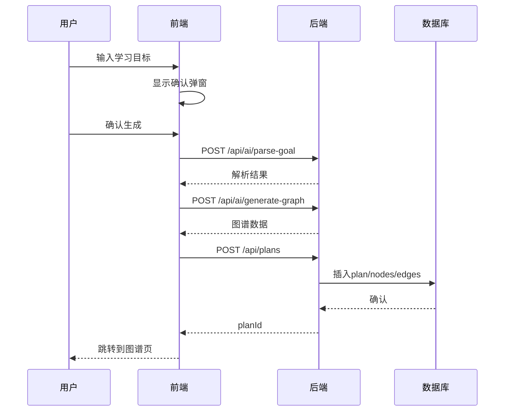

### 4.3 更新节点状态流程

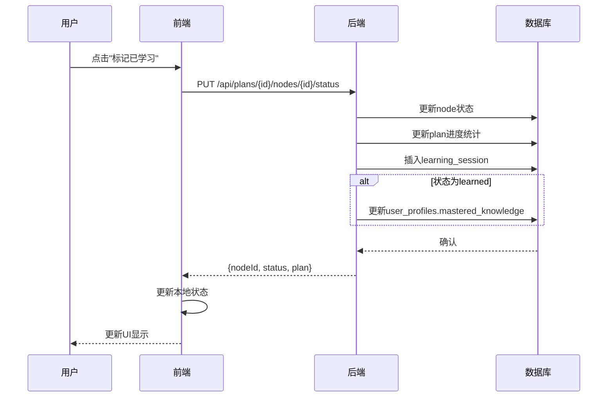

---

## 图5：关键模块依赖关系（L3）

### 5.1 后端模块依赖

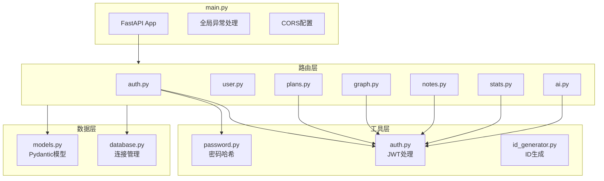

---

### 5.2 前端模块依赖

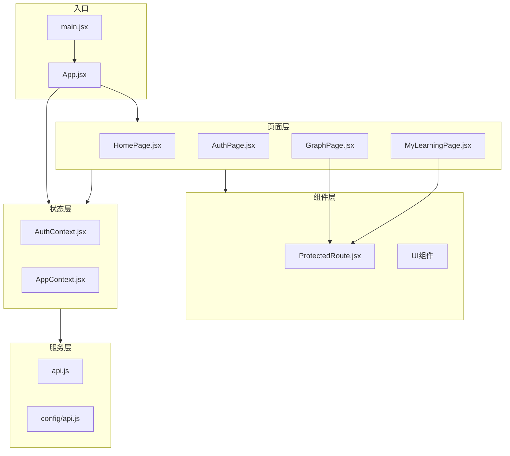

---

## 图6：部署架构（L2）

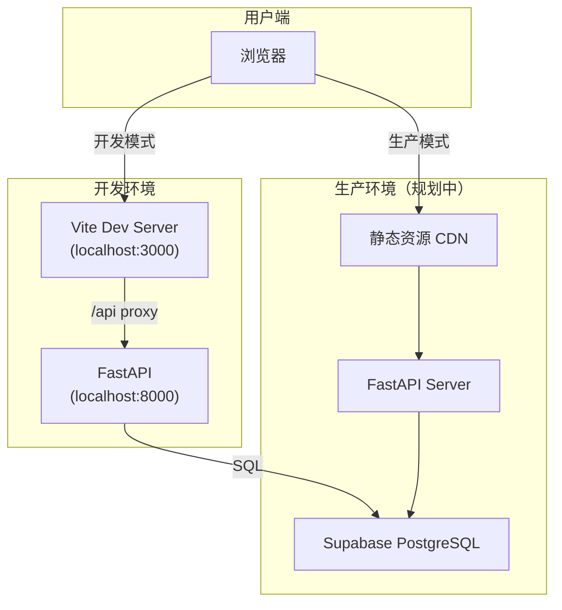

### 说人话
- **开发**：前端Vite（3000端口）→ 代理到后端FastAPI（8000端口）→ Supabase数据库
- **生产**：前端静态资源部署到CDN，后端部署到服务器，共用Supabase数据库

---

## 关键文件速查表

| 层级 | 文件 | 作用 |
|------|------|------|
| **入口** | `ConceptTree/frontend/src/main.jsx` | 前端入口 |
| **入口** | `ConceptTree/frontend/src/App.jsx` | 路由配置 |
| **入口** | `ConceptTree/backend/main.py` | 后端入口 |
| **状态** | `ConceptTree/frontend/src/contexts/AuthContext.jsx` | 认证状态 |
| **状态** | `ConceptTree/frontend/src/contexts/AppContext.jsx` | 业务状态 |
| **API** | `ConceptTree/frontend/src/services/api.js` | API封装 |
| **路由** | `ConceptTree/backend/routers/auth.py` | 认证路由 |
| **路由** | `ConceptTree/backend/routers/plans.py` | 计划路由 |
| **路由** | `ConceptTree/backend/routers/graph.py` | 图谱路由 |
| **模型** | `ConceptTree/backend/epic_N/models.py` (N=1..5) | Epic 各自的 Pydantic 模型 |
| **模型(facade)** | `ConceptTree/backend/models.py` | Pydantic facade (re-exports from epic_N/models.py) |
| **数据库** | `ConceptTree/backend/database.py` | 数据库连接 |

---

